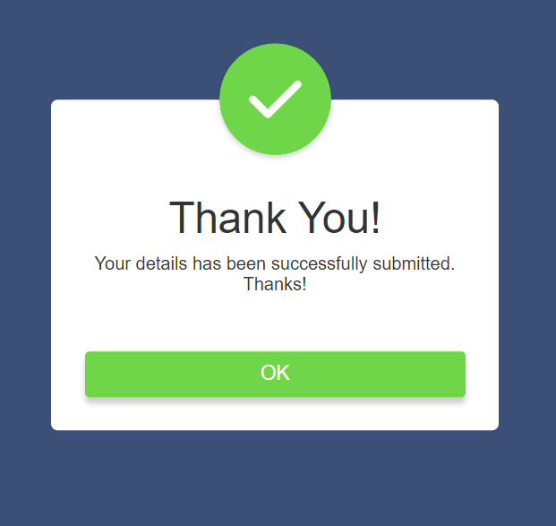

# Popup Form Submission ✨

## Overview
This project features a simple popup form submission where users can click the "Submit" button, triggering a popup confirmation. The popup displays a thank you message along with a tick icon, confirming that the details have been successfully submitted.

## Technologies Used 🚀
- **HTML**
- **CSS**
- **JavaScript**

## Usage 💻
1. Click the "Submit" button to open the popup confirmation.
2. The popup contains a thank you message and a tick icon.
3. Click the "OK" button to close the popup.

## Live Demo 🌐
Live Demo: [Popup Form Submission Demo]()

## Installation
No special installation is required for this project. Simply download the project files and open the `index.html` file in a web browser.

## Popup Styling
- The popup is styled using the "open-popup" class to control its visibility.

## Contributing 🤝
Feel free to use, modify, and contribute to the project! If you have any questions or feedback, you can reach me at your nisagokdemir@gmail.com
## License
This project is licensed under the **MIT License**.

